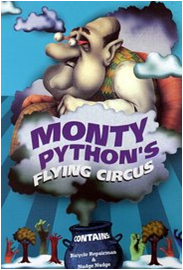
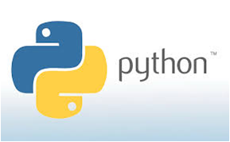

.. _intpy:

Python Intro
=============

1. Introduction
---------------------------------------

Word Python!!
-------------

* Developed by Guido van Rossum during 1985 -1990
* Open Source Under GNU General Public License (GPL)
* Python Version 2.X and 3.X
* Flavours Cython, Jython and IronPython

2. Core of Python
---------------------------------------

* Interpreted
* Interactive
* Object Oriented
* High Level Language

3. Salient Features
---------------------------------------
* Simpler, Shorter, Flexible, Wide Portability
* Easy to Learn, Read and Maintain
* Extendable, GUI Programming and Scalable

4. Unique Features
---------------------------------------
* Dynamic Typing
* High Level Data types
* Automatic Memory Management
* Mixed language System

